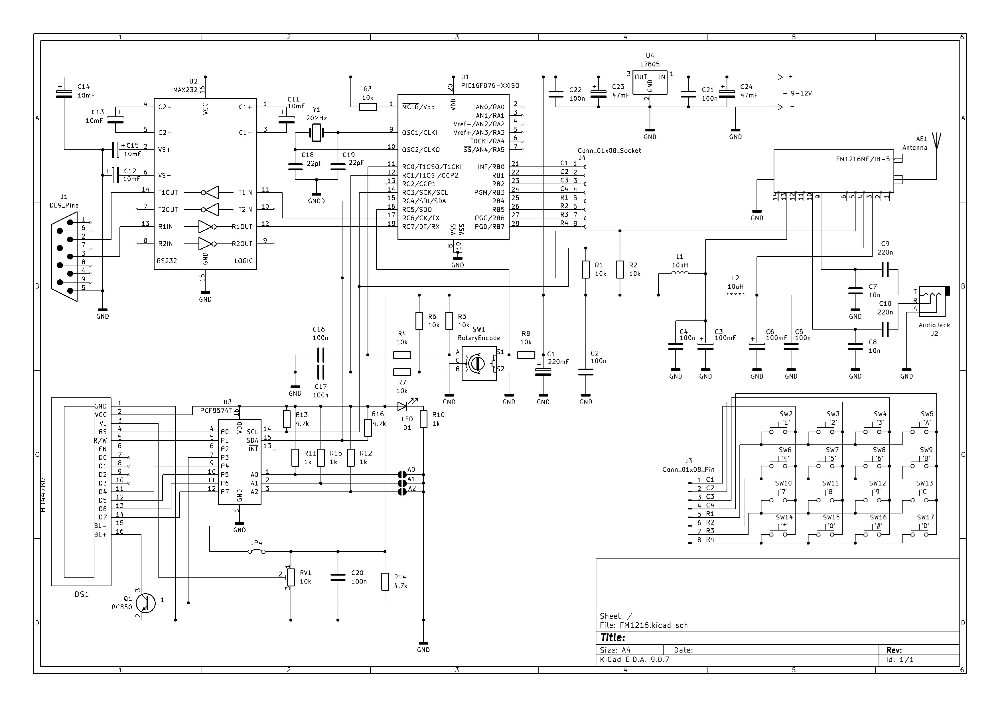

  

# FM радиоприемник на FM1216ME
*Проект создан в академических целях.*

## Технические характеристики
* Частотный диапазон: 65.90 - 108.00 MHz
* Напряжение питания: 9 - 12 V
* Ток потребления: 270 mA

## Органы управления
* Энкодер SW1: Вращение энкодера изменяет частоту радиоприемника
* Нажатие кнопки энкодера SW1: Перечитать информационные биты FM1216ME и вывести в USART
* Назначение кнопок на клавиатуре:

```
{ '1'    '2'     '3'     'SCAN UP' }
{ '4'    '5'     '6'    'SCAN DOWN'}
{ '7'    '8'     '9'     'NOT USE' }
{'ESC'   '0'   'ENTER'   'NOT USE' }
```


## Основные компоненты
* FM1216ME/IH-5
* PIC16F876A
* HD44780
* PCF8574T
* MAX232CPE

## Отладка через USART
Радиоприемник предоставляет следующую информацию через протокол RS232:
```
********* FM1216ME DEBUG BOARD *********
****************************************
            FM FREQ: 92.80MHz
****************************************
********** TUNER STATUS BIT ************
POR:   0
FL:    1
AGC:   1
SOUND: 1
************ IF STATUS BIT *************
VIFL:  1
FMIFL: 0
AFC:   13
*****************************************
```
Подключение к PC осуществлется через COM-порт.
Для соединения с радиоприемником можно использовать minicom `minicom -D /dev/ttyS0 -b 9600`

## Разработка
* Среда - MPLAB X IDE v6.20
* Компилятор - XC8 v1.45
* Редактор схем - KiCad v9.0

## Принципиальная схема

